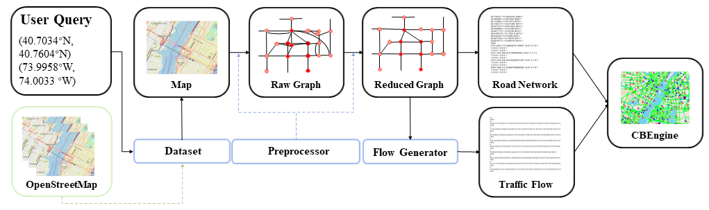

# CBData

CBData is a data network to make use of traffic data in the traffic simulation. In the paper, we present the pipeline to transform raw road network data to simulation inputs and two paradigmatic pipelines to learn from other traffic data. 

Here, we demonstrate three pipelines.

| name                      | content                                                      |
| ------------------------- | ------------------------------------------------------------ |
| Input data transformation | Transform raw road network data to road network inputs and generate traffic flow inputs for simulation accordingly. |
| Learning driving          | Tune driving behaviors of CBEngine according to road observation. |
| Learning routing          | Learn to generate routes according to raw trajectory data and use it to generate traffic flow inputs for simulation. |


### Input data transformation



In this section, we demonstrate how to obtain large-scale input data for traffic simulation. 

We have released our database including the raw road networks of 100 main cities around the world. Google Drive Link: https://drive.google.com/drive/folders/1IyTvWprOA1R_6PVkuh7v9R4xrHcZAmYT?usp=sharing.

In the database, the raw road network of one city consists of three files: 

```
	two edge files:
		edge1.csv
		edge2.csv
	one node file:
		node.csv
```

The code in  `/CBData/input_data_transformation` is our implemented pipeline to transform the raw road network to the inputs for simulation.

To begin with, put the three files in `CBData/unify_data/roadnet/data`.

Run the following command at `CBData/unify_data/roadnet/` to conduct transformation.

```
	python run.py
```

The output road network data will be generated in the folder `CBData/unify_data/roadnet/output` with the name `roadnet.txt`. 

Meanwhile, an assistant file `roadnet_dict.pkl` is also generated. This file helps generate the traffic flow according to the road network.

To generate the traffic flow accordingly, run the following command at `CBData/unify_data`.

```
	cp ./roadnet/output/roadnet_dict.pkl ./flow/data/
	cd ./flow
	python main.py --numveh NUM_VEHICLES
```

The output traffic flow data will be generated in the folder `CBData/unify_data/flow/output` with the name `CBEngine_flow.txt`.  It is noted that we also generate two other traffic flow files of SUMO and Cityflow respectively, with the file name ` SUMO_flow.txt` and  `Cityflow_flow.txt`. Three files correspond to an identical traffic flow, only different in format.

Now we have the complete inputs for traffic simulation with CBEngine:

```
	Road Network: roadnet.txt
	Traffic Flow: CBEngine_flow.txt
```


### Learning driving from traffic data

In this section, we demonstrate to tune the driving parameters in CBEngine using real world road observation. The tuning process is automatically implemented. Concretely, we run the simulation and count the average speed of vehicles on the road for a fixed time step. Then, we compare the speed to the real world observation. A black-box optimization tool is used to minimize the gap. By repeating the process, we tune the simulator to behave as the real world road observation.

For tuning the parameter of the driving model, run this command at `/CBData/learning_from_data/driving/`. 

```
	python main.py
```

After the learning process ends up, optimized parameters are shown at the bottom of the terminal, which can be set for CBEngine before starting the simulation. The loss curve is at `/CBData/learning_from_data/driving/figs/`.


### Learning routing from traffic data

In this section, we demonstrate the process how we learn to generate routes from one kind of raw trajectory data. The generated routes can be then transformed into inputs of CBEngine. Note that raw trajectory data can be in various formats. The data used in this experiments is in a common format: floating car format. 

#### Functions of projects in each folder

| name            | function                                        |
| --------------- | ----------------------------------------------- |
| loss_counter    | Count the loss of RNN model and draw the graph  |
| RNN             | Train RNN model and generate trajtories         |
| roadnet-match   | Transfer origin Shenzhen data to formatted data |
| roadnet-process | Analyze data and generate RNN train data        |

#### Match raw trajectories to the road network

In this section, we will preprocess the data with three steps. First, we will clean the data, where anomaly points are removed e.g. two sequential/consecutive points in one trajectory which stay very far from each other. Second, we match the cleaned data to the road network. Finally, we extract road-level observation from the processed trajectory data.  These processes are aggregated in the script `roadnet-match`.

##### Prepare

1. Open the root directory of the project.

```
    cd ./roadnet-match
```

2. Make directories mentioned before.

```
    mkdir road \
    mkdir track \
    mkdir process \
    mkdir output
```

3. Copy the roadnet to `./road` directory and name them `Shenzhen-inter.txt` and `Shenzhen-inter.txt`.

4. Copy all of the original vehicle flow to `./track`.

##### Build

1. Make a directory to build.

```
    mkdir build
```

2. Get into `./build`.

```
    cd ./build
```

3. Compile the project.

```
    cmake .. -G "Unix Makefiles" \
    make
```

##### Match

1. Run the script.

```
	roadnet-match
```

Now we obtain the unified trajectory data. Specifically, cleaned data is in the folder `/process`, matched trajectory `/output/vehicle`, and road-level observation `/output/road`. These data will be used in the next section.


#### Transform matched trajectories to unified data

RNN is used for learning from data and generating trajectories with a specified OD. To train the RNN model, we need to firstly transform data from the present format to RNN project format.

1. Open the root directory of the project.

```
    cd ./roadnet-process
```

2. make output directory.

```
    mkdir output
```

3. Transform the roadnet from the present format to the format compatible to RNN project.

```
    python CBEngine-to-trajGAIL.py
```

4. Find an OD with maximum kinds of trajectories.

```
    python flow-to-OD.py
```

5. Find the entry and exit of the roadnet.

```
    python find-in-out.py
```

Finally, place the data in `./output` to RNN project.


#### Learn from unified data with RNN

After we generated all the data that RNN project needs, we copy them to `/data` folder under `./RNN`. You can find 5 files under `./roadnet-process/output`, while four of them are needed to run RNN. However, if you don't want to train your model, do not copy these files.

```
    cp -a ./roadnet-process/output/Binomial.csv ./RNN/data/Single_OD/ \
    cp -a ./roadnet-process/output/net-in.pkl ./RNN/data/Network_in_out/ \
    cp -a ./roadnet-process/output/net-out.pkl ./RNN/data/Network_in_out/ \
    cp -a ./roadnet-process/output/Network.txt ./RNN/data/
```

Then, we can train RNN. If you want to try generating trajectories directly, you can skip this step and use the models provided with 0 and 980 epochs trained.

```
    cd ./RNN \
    python ./scripts/behavior_clone/run_bc_rnn.py
```

The model will be saved under folder `./Result/Single_OD`.

After we trained a model, we can use it to generate trajectories with specified OD.

```
    python RNN_generator.py --trained-epoches NUM_EPOCHS
```

*NUM_EPOCHS* is the number in the name of the model in folder `./Result/Single_OD`. After that, you can check the generated trajectories under folder `./Result/Generated_OD`.

Finally, we transform the generated routes to traffic flows in the standard input format of CBEngine, with parameters given in `param.json`.

```
	python OD_to_flow.py
```

 The traffic flow is in the `./flow`.