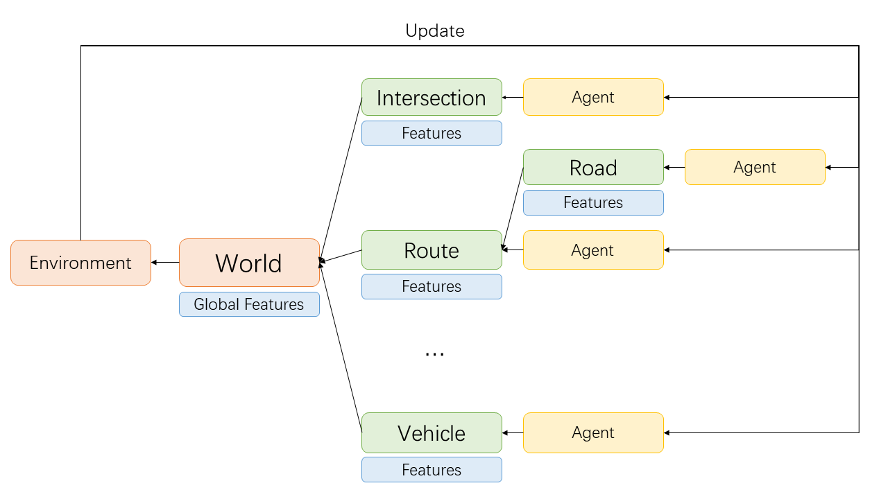

# CBScenario

Based on our large-scale traffic simulation, CBScenario implements a benchmark for two classical scenarios of traffic policies: Traffic Signal Control and Congestion Pricing. Two scenarios share the same interactive python environment. In this profile, we firstly introduce the design of the environment. This is to help users understand CBScenario and develop new own scenarios accordingly. Then, we show how to run the simple benchmark for two existing scenarios. 

### Design CBScenario



The environment in CBScenario is designed to be hierarchical. A World object manages abstraction objects of traffic elements: Intersections (with traffic signals), Roads, Vehicles, and so on.  Every traffic element objects is bind with an agent. The default agent will do nothing to the traffic element. A traffic policy may use agents of several traffic elements to urge those elements on certain behaviors. For example, traffic signal control will modify the traffic signal at intersections. 

For each time step, traffic elements will firstly follow the command from their own agents, update their local features and help the World object to update the global features. Then, the World object computes some metrics for the traffic policy and returns it to the Environment object. The Environment object will summarize the metrics and respond to the agents. Finally, agents learn from the response and tell the traffic element what to do in the next time step. 


### Run the benchmark

#### Scenario 1 (Traffic Signal Control)

This scenario locates at `/scenarios/1_traffic_signal_control/`. To run a baseline, we need to assign some arguments. Concretely, we show the commands to run baselines on Hangzhou dataset as our example.

```
	python run_fixed_time.py --config_file ./dataset/hangzhou/config_hangzhou.json --engine_config_file ./dataset/hangzhou/hangzhou.cfg
	python run_maxpressure.py --config_file ./dataset/hangzhou/config_hangzhou.json --engine_config_file ./dataset/hangzhou/hangzhou.cfg
	python run_sotl.py --config_file ./dataset/hangzhou/config_hangzhou.json --engine_config_file ./dataset/hangzhou/hangzhou.cfg
	python run_dqn.py --config_file ./dataset/hangzhou/config_hangzhou.json --engine_config_file ./dataset/hangzhou/hangzhou.cfg --save_dir ./model/hangzhou/dqn --log_dir ./log/hangzhou/dqn
```

The result can be found in `./train_log/`.  

Specifically, to evaluate DQN (and other possible learning-based methods in the future), we run the following command:

```
	python test_dqn.py --config_file ./dataset/hangzhou/config_hangzhou.json --engine_config_file ./dataset/hangzhou/hangzhou.cfg --save_dir ./model/hangzhou/dqn --log_dir ./log/hangzhou/dqn
```

 The result can be found in `./test_log/`.  

#### Scenario 2 (Congestion Pricing)

This scenario locates at `/scenarios/2_congestion_pricing/`. Similarly, we show the commands to run baselines on the Hangzhou dataset.

```
	python run_nochange.py --config_file ./dataset/hangzhou/config_hangzhou.json --engine_config_file ./dataset/hangzhou/hangzhou.cfg
	python run_arbitrary.py --config_file ./dataset/hangzhou/config_hangzhou.json --engine_config_file ./dataset/hangzhou/hangzhou.cfg
	python run_deltatoll.py --config_file ./dataset/hangzhou/config_hangzhou.json --engine_config_file ./dataset/hangzhou/hangzhou.cfg
	python run_egcn.py --config_file ./dataset/hangzhou/config_hangzhou.json --engine_config_file ./dataset/hangzhou/hangzhou.cfg
```

The result can be found in `./train_log/`.

Specifically, to evaluate eGCN (and other possible learning-based methods in the future), we run the following command:

```
	python test_egcn.py --config_file ./dataset/hangzhou/config_hangzhou.json --engine_config_file ./dataset/hangzhou/hangzhou.cfg --weight_file MODEL_PATH
```

 The result can be found in `./test_log/`.  