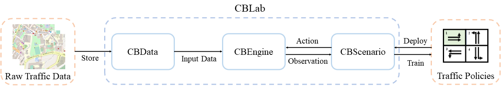

.. OpenEngine documentation master file, created by
   sphinx-quickstart on Mon Apr  4 10:30:32 2022.
   You can adapt this file completely to your liking, but it should at least
   contain the root `toctree` directive.

.. image:: docs/figs/logo.png

\

.. image:: docs/figs/tab.svg
   :target: https://cblab-documentation.readthedocs.io/en/latest/
\

City Brain Lab (CBLab) is a toolkit for scalable traffic simulation. CBLab consists of three components: CBEngine,
CBData, and CBScenario, with which we make it possible to run large-scale traffic simulation on city-level road
networks based on only raw traffic data.

\

\

Learn more about three components respectively:

- `CBEngine`_: Distributed Data Preprocessing
- `CBData`_: Distributed Training
- `CBScenario`_: Scalable Hyperparameter Tuning

.. _`CBEngine`: https://cblab-documentation.readthedocs.io/en/latest/content/cbengine/cbengine.html
.. _`CBData`: https://cblab-documentation.readthedocs.io/en/latest/content/cbdata/cbdata.html
.. _`CBScenario`: https://cblab-documentation.readthedocs.io/en/latest/content/cbscenario/cbscenario.html

Why CBLab?
----------

Traffic policies has made great progress in enhancing the performance of urban traffic. 
However, limited by the efficiency of traffic simulators and shortage in large-scale road network data, these policies
are only trained over small road networks (e.g. 4x3 or 4x4). 

CBLab supports very efficient traffic simulation and enriched large-scale road network data source for simulation.
With CBLab, users can run traffic simulation and train traffic policies on real world road networks with 1,000-10,000 intersections,
which brings about real improvement to the urban traffic. 

Installation
------------
CBEngine, the simulator, is implemented as a Python package `cbengine`. 
Use our Docker image for quick start. 

.. code-block::

    docker pull citybrainlab/cbengine:latest

CBData and CBScenario are both based on easy-to-use Python scripts. Download our source code and view our `documentation`_
for instruction.

.. _`documentation`: https://cblab-documentation.readthedocs.io/en/latest/
